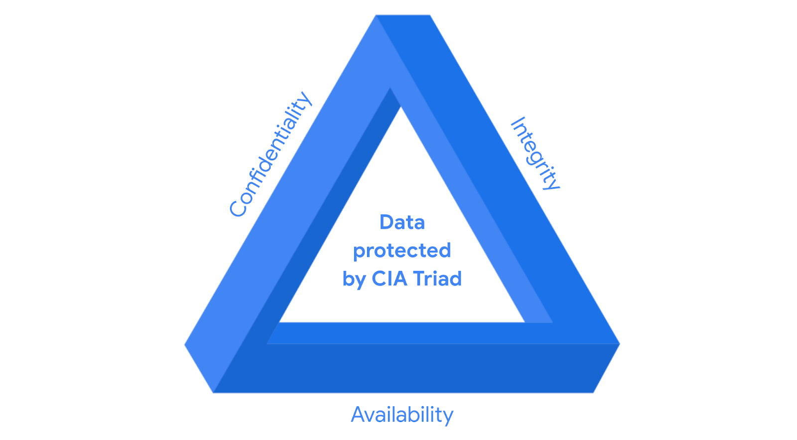

# Controls, frameworks, and compliance
Previously, you were introduced to security frameworks and how they provide a structured approach to implementing a security lifecycle. As a reminder, a security lifecycle is a constantly evolving set of policies and standards. In this reading, you will learn more about how security frameworks, controls, and compliance regulations—or laws—are used together to manage security and make sure everyone does their part to minimize risk.

## How controls, frameworks, and compliance are related
The **confidentiality, integrity, and availability (CIA) triad** is a model that helps inform how organizations consider risk when setting up systems and security policies. 

CIA are the three foundational principles used by cybersecurity professionals to establish appropriate controls that mitigate threats, risks, and vulnerabilities.

As you may recall, **security controls** are safeguards designed to reduce specific security risks. So they are used alongside frameworks to ensure that security goals and processes are implemented correctly and that organizations meet regulatory compliance requirements.

**Security frameworks** are guidelines used for building plans to help mitigate risks and threats to data and privacy. They have four core components:

1. Identifying and documenting security goals
2. Setting guidelines to achieve security goals
3. Implementing strong security processes
4. Monitoring and communicating results
   
**Compliance** is the process of adhering to internal standards and external regulations.

## Specific controls, frameworks, and compliance
The National Institute of Standards and Technology (NIST) is a U.S.-based agency that develops multiple voluntary compliance frameworks that organizations worldwide can use to help manage risk. The more aligned an organization is with compliance, the lower the risk.

Examples of frameworks include the NIST Cybersecurity Framework (CSF) and the NIST Risk Management Framework (RMF). 

> **Note:** Specifications and guidelines can change depending on the type of organization you work for.

In addition to the [NIST CSF](https://www.nist.gov/cyberframework) and [NIST RMF](https://csrc.nist.gov/projects/risk-management/about-rmf), there are several other controls, frameworks, and compliance standards that are important for security professionals to be familiar with to help keep organizations and the people they serve safe.

## The Federal Energy Regulatory Commission - North American Electric Reliability Corporation (FERC-NERC)
FERC-NERC is a regulation that applies to organizations that work with electricity or that are involved with the U.S. and North American power grid. These types of organizations have an obligation to prepare for, mitigate, and report any potential security incident that can negatively affect the power grid. They are also legally required to adhere to the Critical Infrastructure Protection (CIP) Reliability Standards defined by the FERC. 

## The Federal Risk and Authorization Management Program (FedRAMP®)
FedRAMP is a U.S. federal government program that standardizes security assessment, authorization, monitoring, and handling of cloud services and product offerings. Its purpose is to provide consistency across the government sector and third-party cloud providers. 

## Center for Internet Security (CIS®)
CIS is a nonprofit with multiple areas of emphasis. It provides a set of controls that can be used to safeguard systems and networks against attacks. Its purpose is to help organizations establish a better plan of defense. CIS also provides actionable controls that security professionals may follow if a security incident occurs. 

## General Data Protection Regulation (GDPR)
GDPR is a European Union (E.U.) general data regulation that protects the processing of E.U. residents’ data and their right to privacy in and out of E.U. territory. For example, if an organization is not being transparent about the data they are holding about an E.U. citizen and why they are holding that data, this is an infringement that can result in a fine to the organization. Additionally, if a breach occurs and an E.U. citizen’s data is compromised, they must be informed. The affected organization has 72 hours to notify the E.U. citizen about the breach.

## Payment Card Industry Data Security Standard (PCI DSS)
PCI DSS is an international security standard meant to ensure that organizations storing, accepting, processing, and transmitting credit card information do so in a secure environment. The objective of this compliance standard is to reduce credit card fraud. 

## The Health Insurance Portability and Accountability Act (HIPAA)
HIPAA is a U.S. federal law established in 1996 to protect patients' health information. This law prohibits patient information from being shared without their consent. It is governed by three rules: 

1. Privacy
2. Security 
3. Breach notification 

Organizations that store patient data have a legal obligation to inform patients of a breach because if patients' **Protected Health Information** (PHI) is exposed, it can lead to identity theft and insurance fraud. PHI relates to the past, present, or future physical or mental health or condition of an individual, whether it’s a plan of care or payments for care. Along with understanding HIPAA as a law, security professionals also need to be familiar with the Health Information Trust Alliance (HITRUST®), which is a security framework and assurance program that helps institutions meet HIPAA compliance.

## International Organization for Standardization (ISO) 
ISO was created to establish international standards related to technology, manufacturing, and management across borders. It helps organizations improve their processes and procedures for staff retention, planning, waste, and services. 

## System and Organizations Controls (SOC type 1, SOC type 2)
The American Institute of Certified Public Accountants® (AICPA) auditing standards board developed this standard. The SOC1 and SOC2 are a series of reports that focus on an organization's user access policies at different organizational levels such as: 

- Associate

- Supervisor

- Manager

- Executive

- Vendor 

- Others 

They are used to assess an organization’s financial compliance and levels of risk. They also cover confidentiality, privacy, integrity, availability, security, and overall data safety. Control failures in these areas can lead to fraud.

> **Pro tip:** There are a number of regulations that are frequently revised. You are encouraged to keep up-to-date with changes and explore more frameworks, controls, and compliance. Two suggestions to research: the Gramm-Leach-Bliley Act and the Sarbanes-Oxley Act.

## United States Presidential Executive Order 14028
On May 12, 2021, President Joe Biden released an executive order related to improving the nation’s cybersecurity to remediate the increase in threat actor activity. Remediation efforts are directed toward federal agencies and third parties with ties to U.S. 
[critical infrastructure](https://csrc.nist.gov/glossary/term/critical_infrastructure#:~:text=Definition(s)%3A,any%20combination%20of%20those%20matters.)
. For additional information, review the 
[Executive Order on Improving the Nation’s Cybersecurity
.](https://www.whitehouse.gov/briefing-room/presidential-actions/2021/05/12/executive-order-on-improving-the-nations-cybersecurity/)

### Key takeaways
> In this reading you learned more about controls, frameworks, and compliance. You also learned how they work together to help organizations maintain a low level of risk.
>
> As a security analyst, it’s important to stay up-to-date on common frameworks, controls, and compliance regulations and be aware of changes to the cybersecurity landscape to help ensure the safety of both organizations and people.