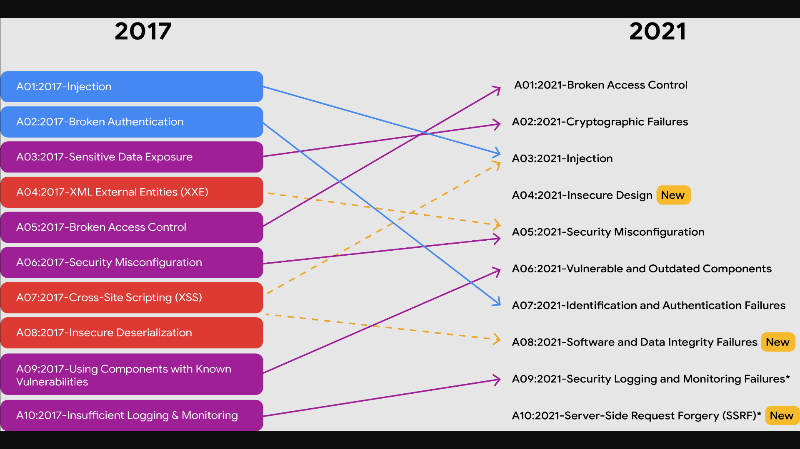

# Manage common threats, risks, and vulnerabilities
Previously, you learned that security involves protecting organizations and people from threats, risks, and vulnerabilities. Understanding the current threat landscapes gives organizations the ability to create policies and processes designed to help prevent and mitigate these types of security issues. In this reading, you will further explore how to manage risk and some common threat actor tactics and techniques, so you are better prepared to protect organizations and the people they serve when you enter the cybersecurity field. 

## Risk management
A primary goal of organizations is to protect assets. An **asset** is an item perceived as having value to an organization. Assets can be digital or physical. Examples of digital assets include the personal information of employees, clients, or vendors, such as: 

- Social Security Numbers (SSNs), or unique national identification numbers assigned to individuals 

- Dates of birth

- Bank account numbers

- Mailing addresses

### Examples of physical assets include:

- Payment kiosks

- Servers

- Desktop computers

- Office spaces

### Some common strategies used to manage risks include:

- Acceptance: Accepting a risk to avoid disrupting business continuity

- Avoidance: Creating a plan to avoid the risk altogether

- Transference: Transferring risk to a third party to manage

- Mitigation: Lessening the impact of a known risk

Additionally, organizations implement risk management processes based on widely accepted frameworks to help protect digital and physical assets from various threats, risks, and vulnerabilities. Examples of frameworks commonly used in the cybersecurity industry include the National Institute of Standards and Technology Risk Management Framework [(NIST RMF)](https://csrc.nist.gov/projects/risk-management/about-rmf) and Health Information Trust Alliance [(HITRUST)](https://hitrustalliance.net/hitrust-framework?utm_term=&utm_campaign=HITRUST_i1_PaidSearch&utm_source=adwords&utm_medium=ppc).

Following are some common types of threats, risks, and vulnerabilities you’ll help organizations manage as a security professional.

## Today’s most common threats, risks, and vulnerabilities

### Threats

A **threat** is any circumstance or event that can negatively impact assets. As an entry-level security analyst, your job is to help defend the organization’s assets from inside and outside threats. Therefore, understanding common types of threats is important to an analyst’s daily work. As a reminder, common threats include:

- **Insider threats:** Staff members or vendors abuse their authorized access to obtain data that may harm an organization.

- **Advanced persistent threats (APTs):** A threat actor maintains unauthorized access to a system for an extended period of time.

### Risks

A **risk** is anything that can impact the confidentiality, integrity, or availability of an asset. A basic formula for determining the level of risk is that risk equals the likelihood of a threat. One way to think about this is that a risk is being late to work and threats are traffic, an accident, a flat tire, etc. 

There are different factors that can affect the likelihood of a risk to an organization’s assets, including:

- **External risk:** Anything outside the organization that has the potential to harm organizational assets, such as threat actors attempting to gain access to private information

- **Internal risk:** A current or former employee, vendor, or trusted partner who poses a security risk

- **Legacy systems:** Old systems that might not be accounted for or updated, but can still impact assets, such as workstations or old mainframe systems. For example, an organization might have an old vending machine that takes credit card payments or a workstation that is still connected to the legacy accounting system.

- **Multiparty risk:** Outsourcing work to third-party vendors can give them access to intellectual property, such as trade secrets, software designs, and inventions.

- **Software compliance/licensing:** Software that is not updated or in compliance, or patches that are not installed in a timely manner

There are many resources, such as the NIST, that provide lists of 
[cybersecurity risks.](https://www.nist.gov/itl/smallbusinesscyber/cybersecurity-basics/cybersecurity-risks) Additionally, the Open Web Application Security Project (OWASP) publishes a standard awareness document about the 
[top 10 most critical security risks](https://owasp.org/www-project-top-ten/) to web applications, which is updated regularly. 

> Note: The OWASP’s common attack types list contains three new risks for the years 2017 to 2021: insecure design, software and data integrity failures, and server-side request forgery. This update emphasizes the fact that security is a constantly evolving field. It also demonstrates the importance of staying up to date on current threat actor tactics and techniques, so you can be better prepared to manage these types of risks.

### Vulnerabilities

 A **vulnerability** is a weakness that can be exploited by a threat. Therefore, organizations need to regularly inspect for vulnerabilities within their systems. Some vulnerabilities include:

- **ProxyLogon:** A pre-authenticated vulnerability that affects the Microsoft Exchange server. This means a threat actor can complete a user authentication process to deploy malicious code from a remote location.

- **ZeroLogon:** A vulnerability in Microsoft’s Netlogon authentication protocol. An authentication protocol is a way to verify a person's identity. Netlogon is a service that ensures a user’s identity before allowing access to a website's location.

- **Log4Shell:** Allows attackers to run Java code on someone else’s computer or leak sensitive information. It does this by enabling a remote attacker to take control of devices connected to the internet and run malicious code.

- **PetitPotam:** Affects Windows New Technology Local Area Network (LAN) Manager (NTLM). It is a theft technique that allows a LAN-based attacker to initiate an authentication request.

- **Security logging and monitoring failures:** Insufficient logging and monitoring capabilities that result in attackers exploiting vulnerabilities without the organization knowing it.

- **Server-side request forgery:** Allows attackers to manipulate a server-side application into accessing and updating backend resources. It can also allow threat actors to steal data.

As an entry-level security analyst, you might work in vulnerability management, which is monitoring a system to identify and mitigate vulnerabilities. Although patches and updates may exist, if they are not applied, intrusions can still occur. For this reason, constant monitoring is important. The sooner an organization identifies a vulnerability and addresses it by patching it or updating their systems, the sooner it can be mitigated, reducing the organization’s exposure to the vulnerability. 

To learn more about the vulnerabilities explained in this section of the reading, as well as other vulnerabilities, explore the 
[NIST National Vulnerability Database](https://nvd.nist.gov/vuln) and 
[CISA Known Exploited Vulnerabilities Catalog.](https://www.cisa.gov/known-exploited-vulnerabilities-catalog)

#### Key takeaways
> In this reading, you learned about some risk management strategies and frameworks that can be used to develop organization-wide policies and processes to mitigate threats, risks, and vulnerabilities. You also learned about some of today’s most common threats, risks, and vulnerabilities to business operations. Understanding these concepts can better prepare you to not only protect against, but also mitigate, the types of security-related issues that can harm organizations and people alike.

#### Resources for more information
To learn more, click the linked terms in this reading. Also, consider exploring the following sites:

- [OWASP Top Ten](https://owasp.org/www-project-top-ten/)

- [NIST RMF](https://csrc.nist.gov/projects/risk-management/about-rmf)