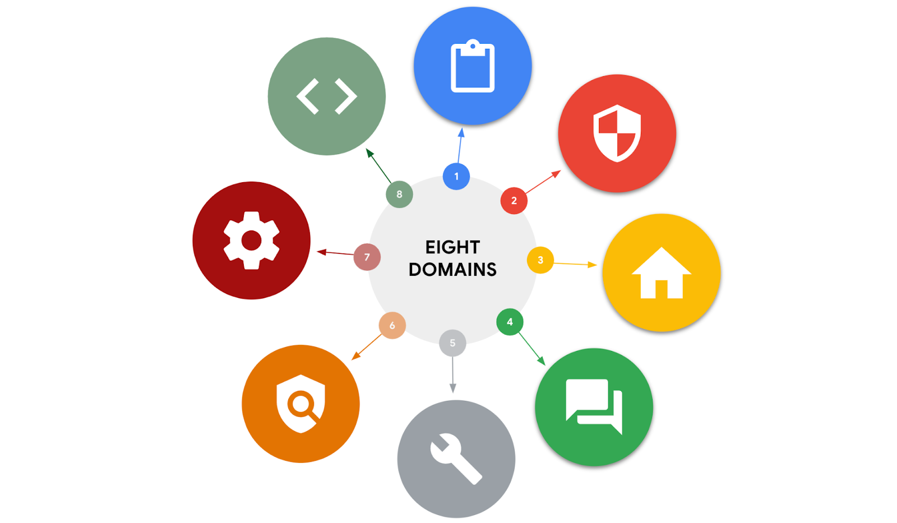

# Security domains cybersecurity analysts need to know
As an analyst, you can explore various areas of cybersecurity that interest you. One way to explore those areas is by understanding different security domains and how they’re used to organize the work of security professionals. In this reading you will learn more about CISSP’s eight security domains and how they relate to the work you’ll do as a security analyst. 

## Domain one: Security and risk management
All organizations must develop their security posture. Security posture is an organization’s ability to manage its defense of critical assets and data and react to change. Elements of the security and risk management domain that impact an organization's security posture include:

- Security goals and objectives

- Risk mitigation processes

- Compliance

- Business continuity plans

- Legal regulations

- Professional and organizational ethics

Information security, or InfoSec, is also related to this domain and refers to a set of processes established to secure information. An organization may use playbooks and implement training as a part of their security and risk management program, based on their needs and perceived risk. There are many InfoSec design processes, such as:

- Incident response

- Vulnerability management

- Application security

- Cloud security

- Infrastructure security

As an example, a security team may need to alter how personally identifiable information (PII) is treated in order to adhere to the European Union's General Data Protection Regulation (GDPR).

## Domain two: Asset security
Asset security involves managing the cybersecurity processes of organizational assets, including the storage, maintenance, retention, and destruction of physical and virtual data. Because the loss or theft of assets can expose an organization and increase the level of risk, keeping track of assets and the data they hold is essential. Conducting a security impact analysis, establishing a recovery plan, and managing data exposure will depend on the level of risk associated with each asset. Security analysts may need to store, maintain, and retain data by creating backups to ensure they are able to restore the environment if a security incident places the organization’s data at risk.

## Domain three: Security architecture and engineering	
This domain focuses on managing data security. Ensuring effective tools, systems, and processes are in place helps protect an organization’s assets and data. Security architects and engineers create these processes.

One important aspect of this domain is the concept of shared responsibility. Shared responsibility means all individuals involved take an active role in lowering risk during the design of a security system. Additional design principles related to this domain, which are discussed later in the program, include:

- Threat modeling

- Least privilege

- Defense in depth

- Fail securely

- Separation of duties

- Keep it simple

- Zero trust

- Trust but verify

An example of managing data is the use of a security information and event management (SIEM) tool to monitor for flags related to unusual login or user activity that could indicate a threat actor is attempting to access private data.

## Domain four: Communication and network security
This domain focuses on managing and securing physical networks and wireless communications. This includes on-site, remote, and cloud communications. 

Organizations with remote, hybrid, and on-site work environments must ensure data remains secure, but managing external connections to make certain that remote workers are securely accessing an organization’s networks is a challenge. Designing network security controls—such as restricted network access—can help protect users and ensure an organization’s network remains secure when employees travel or work outside of the main office. 

## Domain five: Identity and access management
The identity and access management (IAM) domain focuses on keeping data secure. It does this by ensuring user identities are trusted and authenticated and that access to physical and logical assets is authorized. This helps prevent unauthorized users, while allowing authorized users to perform their tasks.

Essentially, IAM uses what is referred to as the principle of least privilege, which is the concept of granting only the minimal access and authorization required to complete a task. As an example, a cybersecurity analyst might be asked to ensure that customer service representatives can only view the private data of a customer, such as their phone number, while working to resolve the customer's issue; then remove access when the customer's issue is resolved.

## Domain six: Security assessment and testing 
The security assessment and testing domain focuses on identifying and mitigating risks, threats, and vulnerabilities. Security assessments help organizations determine whether their internal systems are secure or at risk. Organizations might employ penetration testers, often referred to as “pen testers,” to find vulnerabilities that could be exploited by a threat actor. 

This domain suggests that organizations conduct security control testing, as well as collect and analyze data. Additionally, it emphasizes the importance of conducting security audits to monitor for and reduce the probability of a data breach. To contribute to these types of tasks, cybersecurity professionals may be tasked with auditing user permissions to validate that users have the correct levels of access to internal systems.

## Domain seven: Security operations
The security operations domain focuses on the investigation of a potential data breach and the implementation of preventative measures after a security incident has occurred. This includes using strategies, processes, and tools such as:

- Training and awareness

- Reporting and documentation

- Intrusion detection and prevention

- SIEM tools   

- Log management

- Incident management

- Playbooks

- Post-breach forensics

- Reflecting on lessons learned

The cybersecurity professionals involved in this domain work as a team to manage, prevent, and investigate threats, risks, and vulnerabilities. These individuals are trained to handle active attacks, such as large amounts of data being accessed from an organization's internal network, outside of normal working hours. Once a threat is identified, the team works diligently to keep private data and information safe from threat actors.  

## Domain eight: Software development security
The software development security domain is focused on using secure programming practices and guidelines to create secure applications. Having secure applications helps deliver secure and reliable services, which helps protect organizations and their users.

Security must be incorporated into each element of the software development life cycle, from design and development to testing and release. To achieve security, the software development process must have security in mind at each step. Security cannot be an afterthought.

Performing application security tests can help ensure vulnerabilities are identified and mitigated accordingly. Having a system in place to test the programming conventions, software executables, and security measures embedded in the software is necessary. Having quality assurance and pen tester professionals ensure the software has met security and performance standards is also an essential part of the software development process. For example, an entry-level analyst working for a pharmaceutical company might be asked to make sure encryption is properly configured for a new medical device that will store private patient data. 

#### Key takeaways
> In this reading, you learned more about the focus areas of the eight CISSP security domains. In addition, you learned about InfoSec and the principle of least privilege. Being familiar with these security domains and related concepts will help you gain insight into the field of cybersecurity.